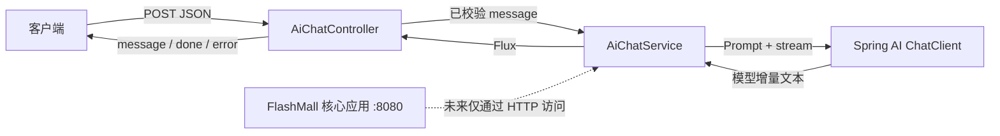

# FlashMall AI Copilot：第一阶段流式对话

## 1. 第一阶段目标

本应用是 FlashMall 核心交易系统之上的独立 Spring Boot 应用，监听 `8081`。第一阶段只完成一个可验证闭环：接收用户问题、调用 Spring AI `ChatClient`、持续获取模型文本片段，并通过 SSE 推送给客户端。

独立部署意味着 AI 应用不会扫描或依赖原项目的 Mapper、Entity、RedisTemplate、RabbitTemplate 和订单消息对象。未来需要商品或订单信息时，由 AI 应用调用 FlashMall 提供的稳定 HTTP API，核心交易应用不反向依赖 Spring AI。

## 2. 架构图



完整请求链路：

```text
用户问题
  → AiChatController（HTTP、DTO 校验）
  → AiChatService（System Prompt、ChatClient）
  → 模型流式输出
  → Flux<String>（Java 内部文本流）
  → ServerSentEvent<String>（HTTP SSE 协议）
  → 客户端逐段接收 message，正常结束接收 done
```

## 3. 核心类职责

| 类 | 职责 | 明确边界 |
|---|---|---|
| `FlashMallAiApplication` | 启动独立 AI 应用 | 不扫描原交易应用 Bean |
| `ChatRequest` | 定义最小请求 DTO，并用 `@NotBlank` 校验问题 | 不承载会话记忆 |
| `AiChatController` | 接收 HTTP 请求，把文本 Flux 转换成 SSE | 不拼 Prompt，不调用业务 Mapper |
| `AiChatService` | 维护 System Prompt，调用 `ChatClient` 并过滤空片段 | 不包含 SSE 协议 |
| `GlobalExceptionHandler` | 将参数、报文和 HTTP 同步异常转成稳定错误响应 | 已开始的模型流错误由 SSE `error` 事件处理 |

## 4. Flux、SSE 与模型流式输出的区别

- 模型流式输出：模型供应商逐步生成 token 或文本片段，是远端能力。
- `Flux<String>`：Reactor 在 Java 应用内部承载异步文本片段的类型，不等同于网络协议。
- SSE：`text/event-stream` HTTP 响应格式，负责把 Flux 中的片段推送给浏览器或命令行客户端。

本项目由 Service 将模型输出保持为 `Flux<String>`，Controller 再翻译为 `ServerSentEvent<String>`。这样更换 HTTP 协议不会污染 Prompt 和模型调用，更换模型实现也不需要改 SSE 适配逻辑。

## 5. 环境变量

必须设置以下变量，仓库不会保存真实密钥或私人代理地址：

| 变量 | 说明 | 示例仅表示格式 |
|---|---|---|
| `OPENAI_API_KEY` | OpenAI 或兼容接口的 API Key | `your-api-key` |
| `OPENAI_BASE_URL` | OpenAI 兼容接口基础地址 | `https://api.openai.com` |
| `OPENAI_MODEL` | 对方接口支持的模型名 | `gpt-4o-mini` |

Windows PowerShell：

```powershell
$env:OPENAI_API_KEY="your-api-key"
$env:OPENAI_BASE_URL="https://api.openai.com"
$env:OPENAI_MODEL="gpt-4o-mini"
```

Bash / zsh：

```bash
export OPENAI_API_KEY="your-api-key"
export OPENAI_BASE_URL="https://api.openai.com"
export OPENAI_MODEL="gpt-4o-mini"
```

如果兼容服务要求在基础地址中包含 `/v1`，以该服务文档为准。Java 代码不绑定具体供应商。

## 6. IDEA 启动

1. 在 IDEA 中将 `flashmall-ai-copilot/pom.xml` 作为 Maven 项目加载。
2. Project SDK 和 Maven Runner JRE 均选择 JDK 17。
3. 新建 Spring Boot Run Configuration，主类选择 `com.flashmall.ai.FlashMallAiApplication`。
4. 在 Run Configuration 的 Environment variables 中设置三个 `OPENAI_*` 变量。
5. 启动后确认日志显示端口 `8081`，访问 `http://localhost:8081/actuator/health`。

核心 FlashMall 可继续独立运行在 `8080`，AI Copilot 不要求 MySQL、Redis 或 RabbitMQ 才能完成本阶段对话链路。

## 7. Maven 构建与启动

仓库根目录执行：

```bash
mvn -f flashmall-ai-copilot/pom.xml clean test
mvn -f flashmall-ai-copilot/pom.xml spring-boot:run
```

Windows 如果全局没有配置 Maven，可使用仓库 Wrapper：

```powershell
.\mvnw.cmd -f flashmall-ai-copilot\pom.xml clean test
.\mvnw.cmd -f flashmall-ai-copilot\pom.xml spring-boot:run
```

## 8. curl 验证

Bash：

```bash
curl -N -X POST 'http://localhost:8081/api/ai/chat/stream' \
  -H 'Content-Type: application/json' \
  -d '{"message":"请介绍一下 FlashMall"}'
```

Windows PowerShell 请调用 `curl.exe`，避免命中旧版 PowerShell 的 `Invoke-WebRequest` 别名：

```powershell
curl.exe -N -X POST "http://localhost:8081/api/ai/chat/stream" `
  -H "Content-Type: application/json" `
  -d '{"message":"请介绍一下 FlashMall"}'
```

健康检查：

```bash
curl http://localhost:8081/actuator/health
```

## 9. 预期 SSE 输出

实际文本会由模型逐段生成，事件边界可能不同，但协议顺序如下：

```text
event:message
data:FlashMall

event:message
data: 是一个电商项目

event:done
data:[DONE]
```

模型调用失败时返回：

```text
event:error
data:AI 服务暂时不可用，请稍后重试。
```

空白 `message` 在模型调用前返回 HTTP `400`，不会建立成功的模型流。

## 10. 常见错误排查

### 启动时报 `OPENAI_API_KEY` 无法解析

三个环境变量必须配置在“启动 Java 进程的同一个终端或 IDEA Run Configuration”中。修改后需要重新启动应用。

### 返回 401 或 403

检查 Key 是否有效、是否有目标模型权限，并确认 Key 没有多余引号或空格。不要把真实 Key 写入 `application.yml`、README 或 `.env` 后提交。

### 返回 404 或模型不存在

核对 `OPENAI_BASE_URL` 是否符合兼容服务要求，特别是是否需要 `/v1`；同时确认 `OPENAI_MODEL` 是该服务实际开放的模型名。

### curl 一直没有输出

必须使用 `-N` 关闭客户端缓冲；同时确认代理、网关没有缓冲 `text/event-stream`。模型可能在首个片段前存在首字延迟。

### 8081 端口被占用

停止占用进程，或仅在本地启动参数中临时覆盖 `--server.port`。不要把 AI 服务改回核心应用使用的 `8080`。

### 测试是否会消耗模型额度

不会。Controller 测试 mock 了 `AiChatService`，没有创建真实模型请求。

## 11. 当前阶段不包含

本阶段不实现 RAG、Embedding、VectorStore、Redis 多轮记忆、Function/Tool Calling、MCP、商品/库存/订单查询、AI 下单、支付、TTL 超时取消，也不修改原 RabbitMQ 链路。

这些能力必须在流式闭环稳定后逐层加入。需要业务数据时，AI 应用通过受控 HTTP API 调用 FlashMall，而不是直接依赖核心项目的 Mapper、Entity 或消息对象。

## 12. 面试口述版

“我把 AI Copilot 设计成独立 Spring Boot 应用，和 8080 的核心交易系统进程、依赖及发布节奏隔离。Controller 负责 DTO 校验与 SSE 协议适配，Service 负责 System Prompt 和 Spring AI ChatClient。ChatClient 的增量内容以 `Flux<String>` 在应用内部传递，Controller 再转成 `message` 事件，正常完成追加 `[DONE]`，异常转换成用户友好的 `error` 事件。第一阶段刻意不接 RAG、记忆和工具调用，先用 mock Service 的 WebFlux 测试证明流式协议闭环，后续再通过稳定 HTTP 接口扩展业务能力，避免让核心交易应用反向依赖 Spring AI。”
